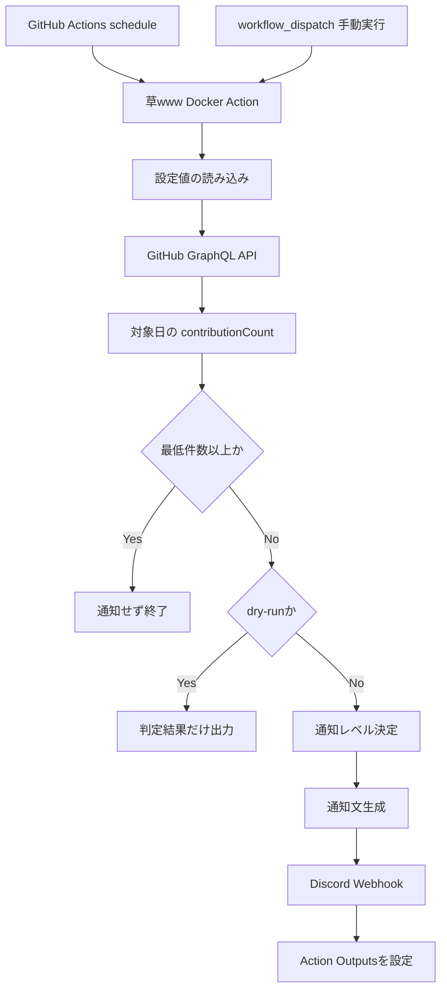

# 草www 設計書

> **今日、草なくて草。**

| 項目 | 内容 |
|---|---|
| プロダクト表示名 | **草www** |
| リポジトリ名 | `kusa-www` |
| GitHub Action参照名 | `hizume0308/kusa-www@v1` |
| Goバイナリ名 | `kusawww` |
| 公開形態 | Public GitHub Action |
| 主実装言語 | Go |
| MVP通知先 | Discord Webhook |
| 既定タイムゾーン | `Asia/Tokyo` |
| ライセンス候補 | MIT |
| 文書バージョン | 1.0 |
| 作成日 | 2026-06-19 |

---

## 1. プロダクト概要

### 1.1 ひとことで

**草www**は、その日のGitHubコントリビューションがまだ0件だったときに、  
Duolingoのストリーク通知のような段階的リマインドを送るGitHub Actionである。

利用者は、自分のPublic RepositoryへWorkflowファイルを追加し、  
通知先のWebhookをGitHub Secretsへ登録するだけで利用できる。

### 1.2 コンセプト

```text
今日、草なくて草。
でも空コミットはもっと草。
意味のある小さな一歩をやろう。
```

単にコントリビューション数を増やすのではなく、次のような小さな開発行動を促す。

- READMEを少し直す
- テストを1件追加する
- Issueを整理する
- 学習コードを追加する
- Pull Requestをレビューする
- 技術メモを残す

### 1.3 解決する課題

GitHubで学習や個人開発を継続したい人には、次の問題がある。

1. 作業しようと思っていても忘れる
2. 夜になってから草がないことに気づく
3. 一般的なTodoアプリではGitHubの状態と連動しない
4. 専用サービスへGitHubアカウントを連携するのは少し不安
5. 自分専用Botを常時運用するのは面倒

草wwwは、GitHub Actions上で完結することでこれらを解決する。

---

## 2. 名前・ブランド設計

### 2.1 正式名称

# 草www

読み方は、次のどちらでもよい。

- くさダブリューダブリューダブリュー
- くさスリー
- くさわら

公式には読み方を固定せず、ユーザーに任せる。

### 2.2 キャッチコピー

第一候補:

> **今日、草なくて草。**

サブコピー:

> GitHubの草がない日に、ちょっとだけ圧をかける。

### 2.3 命名の使い分け

GitHubのURL、Goパッケージ、Dockerタグなどでは日本語や記号を避ける。

| 用途 | 名前 |
|---|---|
| 画面・README上の名称 | `草www` |
| GitHub Repository | `kusa-www` |
| Action Marketplace名 | `Kusa WWW Contribution Reminder` |
| Go module | `github.com/hizume0308/kusa-www` |
| 実行バイナリ | `kusawww` |
| ログ接頭辞 | `[草www]` |
| 設定ファイル例 | `kusa-www.yml` |

### 2.4 ロゴ方針

```text
   ▓▓
  ▓▓▓▓
 ▓▓▓▓▓▓
   www
```

デザイン要素:

- GitHubのコントリビューショングラフを連想する四角
- 「www」を芝生の根元のように配置
- 緑を基調とする
- 小さいアイコンでも判別できる
- GitHub公式ロゴそのものは使用しない

---

## 3. 対象ユーザー

### 3.1 主な利用者

- GitHubで学習記録を続けたい学生
- 個人開発を習慣化したいエンジニア
- コントリビューションのストリークを続けたい人
- サーバーを運用せず無料に近い形で使いたい人
- 外部サービスにGitHubデータを保存されたくない人

### 3.2 利用シナリオ

#### 学習中の学生

21時30分時点で草が0件の場合、Discordへ次を通知する。

```text
今日、草なくて草。

READMEの整理でも、テスト1件でも大丈夫。
あと少しだけ進めてみませんか？
```

#### 個人開発者

23時時点で草が0件の場合、最終通知を送る。

```text
本日の最終通知です。

このままでは草原が途切れます。
意味のある小さな変更を1つだけ残しましょう。
```

---

## 4. 公開・配布方式

### 4.1 Public GitHub Actionとして提供

草www本体をPublic Repositoryで公開する。

利用者は自分のWorkflowから次のように参照する。

```yaml
uses: hizume0308/kusa-www@v1
```

Public Actionは、GitHub Marketplaceへ掲載する前でも他のRepositoryから参照できる。

### 4.2 利用者側に必要なもの

```text
利用者のPublic Repository
├── .github/
│   └── workflows/
│       └── kusa-www.yml
└── Repository Secrets
    └── DISCORD_WEBHOOK_URL
```

### 4.3 草www運営側が保持しないもの

- 利用者のGitHub Token
- Discord Webhook URL
- 利用者の活動履歴
- 通知履歴
- メールアドレス
- ユーザーアカウント
- 利用者データベース

MVPでは中央APIサーバーや中央データベースを持たない。

### 4.4 Public Repositoryでの動作

利用者のPublic Repositoryに置かれたscheduled workflowが、  
公開されている草www Actionを呼び出す。

```text
利用者のPublic Repository
        │
        │ schedule / workflow_dispatch
        ▼
GitHub Actions Runner
        │
        ├── GitHub GraphQL APIへ問い合わせ
        │
        └── 草がなければDiscordへ通知
```

---

## 5. システム構成



### 5.1 構成要素

| 構成要素 | 役割 |
|---|---|
| GitHub Actions | 定期実行・手動実行 |
| 草www Action | 判定ロジック全体 |
| GitHub GraphQL API | コントリビューション情報取得 |
| Discord Webhook | 通知送信 |
| Repository Secrets | Webhook URLの安全な保管 |
| GitHub Actions Outputs | 後続Stepへの結果受け渡し |

---

## 6. MVP機能

### 6.1 実装対象

1. 指定ユーザーの当日コントリビューション数を取得する
2. IANAタイムゾーンを指定できる
3. 最低コントリビューション数を指定できる
4. 件数が基準未満の場合だけ通知する
5. Discord Webhookへ通知する
6. 通知の口調を選択できる
7. 時刻に応じて通知の圧を変える
8. 独自メッセージを指定できる
9. Dry Runで通知せず確認できる
10. `workflow_dispatch`で手動テストできる
11. Action Outputsを返す
12. Secretをログへ出さない
13. GitHub API・Discord APIの一時エラーを再試行する

### 6.2 MVP対象外

- Web管理画面
- GitHub OAuthログイン
- ユーザー登録
- スマートフォンアプリ
- 友達ランキング
- チームランキング
- 中央DB
- AIによる通知文生成
- 自動コミット
- 自動Issue作成
- GitHub App版
- 複数通知先への同時送信
- 永続的な通知重複管理

---

## 7. 利用方法

### 7.1 Discord WebhookをSecretsへ登録

対象Repositoryの設定画面で、次のRepository Secretを登録する。

```text
Name: DISCORD_WEBHOOK_URL
Value: Discordで発行したWebhook URL
```

### 7.2 Workflowを追加

`.github/workflows/kusa-www.yml`

```yaml
name: 草www

on:
  schedule:
    # 19:07 JST
    - cron: "7 10 * * *"

    # 21:37 JST
    - cron: "37 12 * * *"

    # 23:07 JST
    - cron: "7 14 * * *"

  workflow_dispatch:
    inputs:
      dry_run:
        description: "通知せず動作確認する"
        required: false
        type: boolean
        default: false

permissions:
  contents: read

jobs:
  check-grass:
    name: 今日の草を確認
    runs-on: ubuntu-latest

    steps:
      - name: 草www
        id: kusa
        uses: hizume0308/kusa-www@v1
        with:
          github-token: ${{ github.token }}
          username: ${{ github.repository_owner }}
          timezone: Asia/Tokyo
          minimum-contributions: "1"
          notification-provider: discord
          webhook-url: ${{ secrets.DISCORD_WEBHOOK_URL }}
          tone: kusa
          dry-run: ${{ inputs.dry_run || 'false' }}

      - name: 結果表示
        run: |
          echo "date=${{ steps.kusa.outputs.date }}"
          echo "count=${{ steps.kusa.outputs.contribution-count }}"
          echo "notified=${{ steps.kusa.outputs.notified }}"
```

### 7.3 cronを毎時0分からずらす理由

GitHub Actionsは負荷が高い時間帯にscheduled workflowが遅延する場合がある。  
毎時ちょうどを避け、7分や37分などへずらす。

### 7.4 導入手順

```text
1. DiscordでWebhookを発行
2. GitHub Secretsへ登録
3. Workflowファイルを追加
4. Default Branchへマージ
5. workflow_dispatchでDry Run
6. Dry Runを解除して通知テスト
7. schedule運用開始
```

---

## 8. Actionインターフェース

### 8.1 Inputs

| Input | 必須 | 既定値 | 説明 |
|---|---:|---|---|
| `github-token` | Yes | なし | GitHub GraphQL API認証用 |
| `username` | No | Repository Owner | 監視対象GitHubユーザー |
| `timezone` | No | `Asia/Tokyo` | IANAタイムゾーン |
| `minimum-contributions` | No | `1` | 通知を止める最低件数 |
| `notification-provider` | No | `discord` | 通知プロバイダー |
| `webhook-url` | Yes | なし | 通知先Webhook URL |
| `tone` | No | `kusa` | 通知文の口調 |
| `dry-run` | No | `false` | 通知せず判定のみ行う |
| `message-template` | No | 空 | 独自通知文 |
| `mention` | No | 空 | Discordメンション |
| `fail-on-notification-error` | No | `true` | 通知失敗時にActionを失敗させる |
| `suggest-small-task` | No | `true` | 小さなタスク候補を添える |

### 8.2 tone

| 値 | 内容 |
|---|---|
| `kusa` | 草wwwらしい軽いユーモア |
| `gentle` | 優しい |
| `normal` | 標準 |
| `duo` | 夜になるほど圧が強い |
| `samurai` | 武士風 |
| `kansai` | 関西弁風 |
| `minimal` | 件数だけ通知 |

既定値は`kusa`とする。

### 8.3 Outputs

| Output | 型 | 説明 |
|---|---|---|
| `date` | string | 判定対象日 |
| `contribution-count` | integer | 当日のコントリビューション数 |
| `minimum-contributions` | integer | 判定基準 |
| `threshold-met` | boolean | 基準を満たしたか |
| `notified` | boolean | 通知したか |
| `notification-level` | string | `gentle` / `warning` / `final` |
| `suggested-task` | string | 提案した小タスク |
| `result` | string | `passed` / `reminded` / `dry-run` |

---

## 9. GitHub API設計

### 9.1 使用API

GitHub GraphQL APIの次のフィールドを使用する。

```text
user
└── contributionsCollection
    └── contributionCalendar
        └── weeks
            └── contributionDays
                ├── date
                └── contributionCount
```

### 9.2 GraphQL Query

```graphql
query GetContributionCalendar(
  $username: String!
  $from: DateTime!
  $to: DateTime!
) {
  user(login: $username) {
    contributionsCollection(from: $from, to: $to) {
      contributionCalendar {
        weeks {
          contributionDays {
            date
            contributionCount
          }
        }
      }
      restrictedContributionsCount
    }
  }
}
```

### 9.3 取得範囲

日付境界のずれへ強くするため、対象日だけではなく前後を含む範囲を取得する。

例:

```text
対象日: 2026-06-19 Asia/Tokyo

API取得範囲:
2026-06-18 00:00 Asia/Tokyo
    〜
2026-06-21 00:00 Asia/Tokyo
```

返却された`contributionDays.date`から、対象日と一致する要素を選択する。

### 9.4 日付計算

```go
location, err := time.LoadLocation(config.Timezone)
if err != nil {
    return fmt.Errorf("invalid timezone: %w", err)
}

now := clock.Now().In(location)
targetDate := now.Format("2006-01-02")

fromLocal := time.Date(
    now.Year(),
    now.Month(),
    now.Day()-1,
    0, 0, 0, 0,
    location,
)

toLocal := time.Date(
    now.Year(),
    now.Month(),
    now.Day()+2,
    0, 0, 0, 0,
    location,
)

from := fromLocal.UTC()
to := toLocal.UTC()
```

### 9.5 非公開コントリビューション

MVPの既定Tokenは`${{ github.token }}`とする。

この構成では、公開されているコントリビューションの確認を主目的とする。  
非公開・Internal Repositoryの詳細な活動を含めたい場合、Tokenの種類や権限によって取得範囲が変わる。

設計方針:

- MVPではPersonal Access Tokenを必須にしない
- 強い権限を要求しない
- 非公開活動が必要な上級者向け設定は将来追加する
- Tokenは必ず利用者自身のRepository Secretsへ保存する
- 草wwwの中央サーバーへTokenを送らない

---

## 10. 判定ロジック

### 10.1 基本判定

```text
当日の contributionCount >= minimumContributions
    └── 草あり
        ├── 通知しない
        ├── threshold-met = true
        └── result = passed

当日の contributionCount < minimumContributions
    └── 草不足
        ├── dry-run = true
        │   ├── 通知しない
        │   └── result = dry-run
        │
        └── dry-run = false
            ├── 通知する
            ├── notified = true
            └── result = reminded
```

### 10.2 通知レベル

| 現地時刻 | Level | 強さ |
|---|---|---|
| 00:00–20:59 | `gentle` | 軽いリマインド |
| 21:00–22:29 | `warning` | ストリーク警告 |
| 22:30–23:59 | `final` | 最終通知 |

### 10.3 擬似コード

```go
count := githubClient.GetContributionCount(...)

if count >= config.MinimumContributions {
    return Result{
        ThresholdMet: true,
        Notified:     false,
        Status:       "passed",
    }, nil
}

level := determineNotificationLevel(now)

if config.DryRun {
    return Result{
        ThresholdMet:     false,
        Notified:         false,
        NotificationLevel: level,
        Status:           "dry-run",
    }, nil
}

message := messageGenerator.Generate(
    config.Tone,
    level,
    count,
    config.MinimumContributions,
)

err := notifier.Notify(ctx, message)
```

---

## 11. 通知設計

### 11.1 草wwwトーン

#### gentle

```text
今日、まだ草なくて草。

READMEを1行直すだけでも前進です。
小さな作業を1つだけどうですか？
```

#### warning

```text
草がない状態、そろそろ笑えなくなってきました。

テスト追加、Issue整理、学習メモ。
どれか1つだけ進めましょう。
```

#### final

```text
本日の最終・草wwwです。

このままでは草原が途切れます。
意味のある変更を1つだけ残しましょう。
```

### 11.2 既に草がある場合

既定では通知しない。

ログ:

```text
[草www] 今日の草: 3
[草www] 十分生えています。解散。
```

将来的に成功通知を有効化できるようにする。

```yaml
with:
  notify-on-success: "true"
```

成功通知例:

```text
草、生えてて草。
本日も継続できています。
```

### 11.3 小タスク候補

通知に、次から1件をランダムで添える。

```text
READMEの分かりにくい説明を1箇所直す
テストケースを1件追加する
TODOをIssueへ移す
学習した内容を3行だけ残す
使っていないコードを整理する
エラーメッセージを分かりやすくする
Pull Requestを1件レビューする
依存関係の更新内容を確認する
```

禁止候補:

```text
空コミットを作る
日付だけ変更する
無意味な文字列を追加する
コミット数だけを増やす
```

### 11.4 Discord Payload

```json
{
  "username": "草www",
  "content": "今日、草なくて草。",
  "embeds": [
    {
      "title": "GitHub Contribution Reminder",
      "description": "READMEを1行直すだけでも前進です。",
      "fields": [
        {
          "name": "対象日",
          "value": "2026-06-19",
          "inline": true
        },
        {
          "name": "現在の草",
          "value": "0",
          "inline": true
        },
        {
          "name": "目標",
          "value": "1",
          "inline": true
        }
      ],
      "footer": {
        "text": "草www"
      }
    }
  ]
}
```

---

## 12. Goアプリケーション設計

### 12.1 ディレクトリ構成

```text
kusa-www/
├── cmd/
│   └── kusawww/
│       └── main.go
├── internal/
│   ├── config/
│   │   ├── config.go
│   │   └── validation.go
│   ├── contribution/
│   │   ├── client.go
│   │   ├── github_graphql.go
│   │   └── model.go
│   ├── notifier/
│   │   ├── notifier.go
│   │   └── discord.go
│   ├── message/
│   │   ├── generator.go
│   │   ├── templates.go
│   │   └── tasks.go
│   ├── usecase/
│   │   └── check_grass.go
│   ├── action/
│   │   ├── inputs.go
│   │   └── outputs.go
│   └── clock/
│       ├── clock.go
│       └── system_clock.go
├── docs/
├── examples/
├── action.yml
├── Dockerfile
├── go.mod
├── go.sum
├── README.md
├── CONTRIBUTING.md
├── SECURITY.md
├── CHANGELOG.md
├── CODE_OF_CONDUCT.md
└── LICENSE
```

### 12.2 主要インターフェース

```go
type ContributionClient interface {
    GetContributionCount(
        ctx context.Context,
        username string,
        from time.Time,
        to time.Time,
        targetDate string,
    ) (int, error)
}

type Notifier interface {
    Notify(ctx context.Context, message Message) error
}

type MessageGenerator interface {
    Generate(input GenerateInput) Message
}

type Clock interface {
    Now() time.Time
}
```

### 12.3 ユースケース

```go
type CheckGrassUseCase struct {
    contributionClient ContributionClient
    notifier           Notifier
    messageGenerator   MessageGenerator
    clock              Clock
}
```

### 12.4 処理順序

```text
1. Action Inputsを読む
2. 入力値を検証する
3. 現在日時を対象タイムゾーンへ変換する
4. API取得範囲を計算する
5. GitHub GraphQL APIを呼ぶ
6. 対象日の件数を抽出する
7. 最低件数と比較する
8. 通知レベルを決める
9. 必要なら通知文を生成する
10. Discordへ送信する
11. GitHub Actions Outputsを書き込む
12. 安全なログを出力する
```

---

## 13. `action.yml`案

```yaml
name: Kusa WWW Contribution Reminder
description: Reminds you when today's GitHub contribution graph is still empty
author: HizKz

branding:
  icon: activity
  color: green

inputs:
  github-token:
    description: GitHub token for the GraphQL API
    required: true

  username:
    description: GitHub username to monitor
    required: false
    default: ${{ github.repository_owner }}

  timezone:
    description: IANA timezone
    required: false
    default: Asia/Tokyo

  minimum-contributions:
    description: Minimum contributions required today
    required: false
    default: "1"

  notification-provider:
    description: Notification provider
    required: false
    default: discord

  webhook-url:
    description: Notification webhook URL
    required: true

  tone:
    description: Notification tone
    required: false
    default: kusa

  dry-run:
    description: Check without sending a notification
    required: false
    default: "false"

  message-template:
    description: Custom notification message
    required: false
    default: ""

  mention:
    description: Optional Discord mention
    required: false
    default: ""

  suggest-small-task:
    description: Include a meaningful small task suggestion
    required: false
    default: "true"

outputs:
  date:
    description: Checked local date

  contribution-count:
    description: Contribution count for the checked date

  minimum-contributions:
    description: Required minimum contribution count

  threshold-met:
    description: Whether the threshold was met

  notified:
    description: Whether a notification was sent

  notification-level:
    description: Notification level

  suggested-task:
    description: Suggested meaningful task

  result:
    description: Action result

runs:
  using: docker
  image: Dockerfile
```

---

## 14. Docker設計

### 14.1 Multi-stage Build

```dockerfile
FROM golang:1.24-alpine AS builder

WORKDIR /src

COPY go.mod go.sum ./
RUN go mod download

COPY . .

RUN CGO_ENABLED=0 GOOS=linux GOARCH=amd64 \
    go build \
    -trimpath \
    -ldflags="-s -w" \
    -o /out/kusawww \
    ./cmd/kusawww

FROM gcr.io/distroless/static-debian12:nonroot

COPY --from=builder /out/kusawww /kusawww

ENTRYPOINT ["/kusawww"]
```

### 14.2 方針

- Multi-stage Buildで最終Imageを小さくする
- `CGO_ENABLED=0`で静的バイナリ化する
- non-root userで実行する
- Shellを含まないImageを使用する
- TokenやWebhookをImageへ埋め込まない
- Go module cacheを活用する

---

## 15. Repository構成

```text
kusa-www/
├── .github/
│   ├── ISSUE_TEMPLATE/
│   │   ├── bug_report.yml
│   │   └── feature_request.yml
│   ├── workflows/
│   │   ├── ci.yml
│   │   ├── codeql.yml
│   │   ├── release.yml
│   │   └── action-test.yml
│   ├── dependabot.yml
│   └── CODEOWNERS
├── cmd/
├── internal/
├── docs/
│   ├── architecture.md
│   ├── security.md
│   ├── notification-tones.md
│   └── troubleshooting.md
├── examples/
│   ├── discord.yml
│   ├── dry-run.yml
│   ├── custom-message.yml
│   └── multiple-times.yml
├── action.yml
├── Dockerfile
├── go.mod
├── go.sum
├── README.md
├── CONTRIBUTING.md
├── SECURITY.md
├── CHANGELOG.md
├── CODE_OF_CONDUCT.md
├── LICENSE
└── logo.svg
```

---

## 16. セキュリティ設計

### 16.1 最小権限

利用例では次を指定する。

```yaml
permissions:
  contents: read
```

草wwwはRepositoryへの書き込みを行わない。

### 16.2 Secret管理

Webhook URLと追加Tokenは利用者のGitHub Secretsへ保存する。

禁止事項:

- Webhook URLをWorkflowへ直書きしない
- TokenをREADMEへ記載しない
- 入力値を一括でログ出力しない
- HTTP Request Headerをデバッグ出力しない
- エラーにSecretを埋め込まない
- Pull Requestの任意コードへSecretを渡さない

### 16.3 ログマスキング

GitHubによるSecretマスキングだけに依存せず、アプリ側でも次を行う。

```go
func sanitizeError(message string, secrets ...string) string {
    for _, secret := range secrets {
        if secret == "" {
            continue
        }
        message = strings.ReplaceAll(message, secret, "***")
    }
    return message
}
```

### 16.4 Action参照バージョン

使いやすさ重視:

```yaml
uses: hizume0308/kusa-www@v1
```

再現性・セキュリティ重視:

```yaml
uses: hizume0308/kusa-www@<full-commit-sha>
```

READMEでは両方を案内する。

### 16.5 Supply Chain対策

- Dependabotを有効化
- CodeQLを有効化
- `govulncheck`をCIで実行
- Release tagへ署名を検討
- Release Notesを残す
- Major tag更新を自動化する
- 外部Actionは可能な限りcommit SHAで固定する

---

## 17. エラー処理

| エラー | 動作 |
|---|---|
| ユーザーが存在しない | 明確なメッセージで失敗 |
| Tokenが空 | 入力エラー |
| GitHub API 401 | Token無効として失敗 |
| GitHub API 403 | 権限またはRate Limitとして失敗 |
| GitHub API 429 | Retry後に失敗 |
| GitHub API 5xx | 指数バックオフでRetry |
| GraphQL `errors` | 内容を安全に整形して失敗 |
| タイムゾーン不正 | 入力エラー |
| 最低件数が負数 | 入力エラー |
| Webhook URLが空 | 入力エラー |
| Discord 400 | PayloadまたはURLエラー |
| Discord 401/403 | Webhook権限エラー |
| Discord 429 | `Retry-After`に従ってRetry |
| Discord 5xx | 指数バックオフでRetry |
| タイムアウト | Retry後に失敗 |
| Dry Run | 通知せず成功 |
| 草あり | 通知せず成功 |

### 17.1 Retry方針

```text
最大試行回数: 3回
基本待機時間: 1秒
待機時間: 1秒 → 2秒 → 4秒
Jitter: 0〜500ms
```

再試行対象:

- HTTP 429
- HTTP 500
- HTTP 502
- HTTP 503
- HTTP 504
- 一時的なnetwork error
- timeout

再試行しない:

- HTTP 400
- HTTP 401
- HTTP 403
- 不正な入力
- 存在しないユーザー

---

## 18. GitHub Actions固有の注意

### 18.1 scheduleはDefault Branchで動く

WorkflowファイルはDefault Branchに存在する必要がある。

### 18.2 cronはUTC

例:

| 日本時間 | UTC cron |
|---|---|
| 19:07 JST | `7 10 * * *` |
| 21:37 JST | `37 12 * * *` |
| 23:07 JST | `7 14 * * *` |

夏時間を採用する地域では、cron自体はUTCであるため時刻調整が必要になる。

### 18.3 実行時刻は厳密ではない

scheduled workflowは、GitHub Actionsの混雑時に遅れる場合がある。

草wwwでは「秒単位の通知」ではなく、  
夕方・夜・深夜の習慣化リマインドとして扱う。

### 18.4 60日間活動がないPublic Repository

Public Repositoryで長期間Repository活動がない場合、scheduled workflowが自動的に無効になる場合がある。

READMEで次を案内する。

- 普段利用しているRepositoryへWorkflowを置く
- Actions画面でWorkflowが有効か定期確認する
- 無効になった場合は手動で再有効化する
- `workflow_dispatch`で動作確認できるようにする

### 18.5 反映遅延

作業直後はGitHubのコントリビューショングラフへ反映されていない場合がある。

対策:

- 1回目の通知を早めにする
- 最終通知時に再取得する
- 通知文を断定ではなく「現在の表示では0件」とする
- 将来、短時間の再確認オプションを追加する

---

## 19. 重複通知対策

### 19.1 MVP

MVPでは中央DBを持たないため、手動再実行などにより同じ時間帯で複数回通知される可能性がある。

初期対策:

- 推奨cronをREADMEへ掲載
- Workflowの`concurrency`を設定する
- 同時実行をキャンセルする

```yaml
concurrency:
  group: kusa-www-${{ github.repository }}-${{ github.ref }}
  cancel-in-progress: true
```

### 19.2 v1.1以降

GitHub Actions CacheまたはArtifactへ当日の通知状態を保存する。

保存例:

```json
{
  "date": "2026-06-19",
  "sentLevels": [
    "gentle",
    "warning"
  ]
}
```

ただしCacheは厳密なデータベースではないため、完全な一意性は保証しない。

---

## 20. ログ設計

### 20.1 通知した場合

```text
[草www] user=hizume0308
[草www] timezone=Asia/Tokyo
[草www] target_date=2026-06-19
[草www] contribution_count=0
[草www] minimum_contributions=1
[草www] notification_level=warning
[草www] notification_provider=discord
[草www] notification_sent=true
```

### 20.2 草がある場合

```text
[草www] contribution_count=3
[草www] threshold_met=true
[草www] 草、生えてて草。通知しません。
```

### 20.3 Dry Run

```text
[草www] dry_run=true
[草www] contribution_count=0
[草www] 通知条件を満たしていますが、Dry Runのため送信しません。
```

### 20.4 ログへ出さない情報

```text
GitHub Token
Discord Webhook URL
Authorization Header
完全なHTTP Request
Secretを含むエラー本文
```

---

## 21. テスト設計

### 21.1 Unit Test

#### config

- 必須値が揃っている
- Tokenが空
- Webhookが空
- 不正なタイムゾーン
- 最低件数が0
- 最低件数が負数
- 不正なtone
- boolean入力の変換

#### date

- Asia/Tokyoの日付境界
- UTCの日付境界
- 日付変更直前・直後
- うるう日
- 夏時間の開始・終了
- 前後3日取得範囲

#### judgment

- 0件 / 目標1件
- 1件 / 目標1件
- 1件 / 目標2件
- 10件 / 目標1件
- Dry Run
- 通知レベル境界

#### message

- tone別生成
- level別生成
- 独自テンプレート
- mentionあり
- 小タスク提案あり・なし
- HTML/Markdownに特殊文字を含むユーザー名

### 21.2 HTTP Test

`httptest.Server`を利用する。

GitHub API:

- 正常レスポンス
- ユーザーなし
- `data.user = null`
- GraphQL errors
- 401
- 403
- 429
- 500
- timeout
- 不正JSON

Discord:

- 204
- 400
- 401
- 403
- 429
- 500
- timeout
- Retry成功
- Retry上限超過

### 21.3 Integration Test

- Action Inputsを環境変数から読み込める
- `$GITHUB_OUTPUT`へ正しく出力できる
- Docker Imageが起動する
- Secretがログへ出ない
- Dry Runで外部通知されない

### 21.4 E2E Test

テスト用Public Repositoryで実行する。

シナリオ:

```text
1. workflow_dispatch + dry-run
2. 監視対象を草0件のテストユーザーへ設定
3. テスト用Discord Webhookへ通知
4. 草ありユーザーで通知されないことを確認
5. 不正Tokenで失敗メッセージを確認
6. 不正Webhookで通知エラーを確認
```

### 21.5 受け入れ条件

MVP完成条件:

- 第三者がREADMEだけで導入できる
- Public Repositoryから`@v1`で利用できる
- 当日0件ならDiscordへ通知される
- 当日1件以上なら通知されない
- Asia/Tokyoの日付判定が正しい
- Dry Runで通知されない
- Secretがログへ出ない
- GitHub APIの一時障害をRetryできる
- DiscordのRate Limitへ対応できる
- Action Outputsが利用できる

---

## 22. CI/CD設計

### 22.1 Pull Request時

```text
go fmt check
go test ./...
go test -race ./...
go vet ./...
staticcheck
golangci-lint
govulncheck
Docker build
action.yml validation
Secret scan
```

### 22.2 Default BranchへのMerge時

```text
全テスト
Docker build
Dry Run E2E
Coverage生成
```

### 22.3 Release時

```text
1. SemVer tag作成
2. CHANGELOG更新
3. GitHub Release作成
4. Release Notes生成
5. Action E2E実行
6. Major tag更新
7. Marketplace情報更新
```

### 22.4 バージョン例

```text
v0.1.0  初期プロトタイプ
v0.2.0  Public Action対応
v1.0.0  安定版
v1.1.0  Slack対応
v2.0.0  GitHub App版
```

---

## 23. GitHub Marketplace公開方針

### 23.1 Marketplace名

```text
Kusa WWW Contribution Reminder
```

日本語だけでは検索されにくいため、Marketplace上の正式名は英語を含める。

READMEの先頭では大きく「草www」と表示する。

### 23.2 Marketplace説明

```text
A playful GitHub Action that reminds you when today's contribution graph is still empty.
```

### 23.3 Branding

```yaml
branding:
  icon: activity
  color: green
```

### 23.4 公開前チェック

- RepositoryがPublic
- Rootに`action.yml`が1つある
- Action名がMarketplace上で重複していない
- READMEに利用例がある
- LICENSEがある
- SECURITY.mdがある
- Release tagがある
- 入力・出力が説明されている
- Secretの設定方法が説明されている
- 制限事項が説明されている

---

## 24. README冒頭案

```markdown
# 草www 🌱

> 今日、草なくて草。

その日のGitHubコントリビューションがまだ0件だったら、
Discordへちょっとだけ圧をかけるGitHub Actionです。

```yaml
- name: 草www
  uses: hizume0308/kusa-www@v1
  with:
    github-token: ${{ github.token }}
    timezone: Asia/Tokyo
    webhook-url: ${{ secrets.DISCORD_WEBHOOK_URL }}
```

- サーバー不要
- データベース不要
- GitHub Actionsだけで動作
- TokenとWebhookを草www側へ保存しない
- 空コミットではなく、意味のある小さな作業を提案

草があれば何もしません。
草がなければ、草wwwが来ます。
```

---

## 25. 開発ロードマップ

### Phase 1: ローカルCLI

目標: Goプログラム単体で判定できる。

- 環境変数読込
- GraphQL API接続
- 当日件数表示
- エラー処理
- Unit Test

完了条件:

```bash
GITHUB_TOKEN=... \
GITHUB_USERNAME=hizume0308 \
TIMEZONE=Asia/Tokyo \
go run ./cmd/kusawww
```

出力:

```text
[草www] 2026-06-19 の草: 0
```

### Phase 2: Discord通知

- Discord Webhook Client
- Payload生成
- tone実装
- Retry
- Dry Run
- Secretマスキング

### Phase 3: GitHub Action化

- `action.yml`
- Dockerfile
- Inputs
- Outputs
- 利用例Workflow
- Public Repositoryからの参照テスト

### Phase 4: v1.0.0

- README完成
- CI完成
- SECURITY.md
- CONTRIBUTING.md
- Marketplace公開
- Major tag管理

### Phase 5: 拡張

- Slack Webhook
- ntfy
- 通知成功メッセージ
- 週間レポート
- ストリーク日数
- 重複通知抑制
- 多言語化

### Phase 6: GitHub App版

- GitHub Appインストール
- Web設定画面
- 複数Repository管理
- チーム利用
- 通知履歴
- ランキング

---

## 26. 実装タスク分解

### Milestone 1: 草を数える

- [ ] Go module初期化
- [ ] Config構造体
- [ ] GitHub GraphQL Client
- [ ] Query定義
- [ ] 対象日抽出
- [ ] Unit Test
- [ ] CLI出力

### Milestone 2: 草がなければ通知する

- [ ] Notifier interface
- [ ] Discord実装
- [ ] Message Generator
- [ ] tone `kusa`
- [ ] 通知レベル
- [ ] 小タスク候補
- [ ] Retry
- [ ] Dry Run

### Milestone 3: Public Actionにする

- [ ] Dockerfile
- [ ] action.yml
- [ ] GitHub Outputs
- [ ] Workflow例
- [ ] Public Repository E2E
- [ ] `v0.1.0` Release

### Milestone 4: 他人が使える品質にする

- [ ] README
- [ ] Troubleshooting
- [ ] SECURITY.md
- [ ] CONTRIBUTING.md
- [ ] CODE_OF_CONDUCT.md
- [ ] Issue Templates
- [ ] CI
- [ ] Dependabot
- [ ] `v1.0.0` Release

---

## 27. 非機能要件

### 27.1 性能

- Action全体を通常30秒以内で完了する
- GitHub API呼び出しは原則1回
- Discord送信は原則1回
- メモリ使用量は64MB以内を目標
- Docker Imageは可能な限り小さくする

### 27.2 可用性

- 外部APIの一時障害へRetry
- 通知失敗と判定失敗を区別する
- Dry Runで設定を検証できる
- 手動実行経路を必ず残す

### 27.3 保守性

- 外部サービスをinterfaceで分離
- 時刻をClockで抽象化
- 通知文をコードから分離
- Config validationを一箇所へ集約
- エラーを`fmt.Errorf("%w")`でwrap
- package責務を小さく保つ

### 27.4 移植性

MVPはDocker Actionのため、GitHub-hosted Linux Runnerを標準とする。

推奨:

```yaml
runs-on: ubuntu-latest
```

---

## 28. 将来機能

### 28.1 ストリーク

```text
現在の連続草日数: 14日
最長記録: 31日
```

### 28.2 週間レポート

```text
今週の草wwwレポート

月 3
火 1
水 0
木 4
金 2
土 0
日 1

合計: 11
継続日数: 5日
```

### 28.3 圧レベル

```yaml
with:
  pressure: low
```

| 値 | 動作 |
|---|---|
| `low` | 1日1回、優しく通知 |
| `normal` | 夕方・夜の2回 |
| `high` | 夕方・夜・最終の3回 |
| `www` | 独特な通知文になる |

### 28.4 休日モード

```yaml
with:
  active-days: "mon,tue,wed,thu,fri"
```

### 28.5 猶予日

```yaml
with:
  grace-days-per-month: "2"
```

体調不良や忙しい日にストリークを責めすぎない設計とする。

---

## 29. 設計判断まとめ

| 判断 | 理由 |
|---|---|
| 名称を「草www」にする | 面白く、機能も連想しやすい |
| Repository名を`kusa-www`にする | URL・CLI・CIで扱いやすい |
| Public GitHub Actionにする | 誰でも導入しやすい |
| Go + Docker Action | Go学習と配布を両立できる |
| Discordから始める | Webhookが単純で通知確認しやすい |
| 中央サーバーを持たない | 運用費と個人情報リスクを抑える |
| `${{ github.token }}`を既定にする | 初期導入のハードルを下げる |
| PATを必須にしない | 強い権限を要求しない |
| Asia/Tokyoを既定にする | 初期利用者に合う |
| cronを0分からずらす | scheduled workflowの混雑を避けやすくする |
| 空コミットを提案しない | 習慣の質を落とさない |
| Dry Runを用意する | 導入時に安全に確認できる |
| Action Outputsを返す | 他のWorkflowと組み合わせられる |
| `@v1`とSHA固定を案内する | 使いやすさと安全性を両立する |

---

## 30. MVP完成定義

以下をすべて満たした時点で、草www v1.0.0を完成とする。

> 利用者が自分のPublic RepositoryへWorkflowを追加し、  
> Discord WebhookをRepository Secretへ登録すると、  
> Asia/Tokyoにおける当日のGitHubコントリビューションが  
> 指定件数未満の場合だけ、草wwwから通知が届く。

さらに次を満たす。

- Public Repositoryから`hizume0308/kusa-www@v1`で利用できる
- 中央サーバー・中央DBが不要
- 利用者のSecretを保存しない
- Dry Runができる
- 手動実行できる
- Secretがログへ出ない
- READMEだけで第三者が導入できる
- GitHub Marketplaceへ公開できる構成になっている

---

## 31. 参考資料

- GitHub Docs: Creating a Docker container action  
  https://docs.github.com/en/actions/tutorials/use-containerized-services/create-a-docker-container-action

- GitHub Docs: Publishing actions in GitHub Marketplace  
  https://docs.github.com/en/actions/how-tos/creating-and-publishing-actions/publishing-actions-in-github-marketplace

- GitHub Docs: Workflow syntax for GitHub Actions  
  https://docs.github.com/en/actions/writing-workflows/workflow-syntax-for-github-actions

- GitHub Docs: Events that trigger workflows  
  https://docs.github.com/en/actions/writing-workflows/choosing-when-your-workflow-runs/events-that-trigger-workflows

- GitHub Docs: GraphQL Objects — ContributionsCollection  
  https://docs.github.com/en/graphql/reference/objects

- GitHub Docs: Forming calls with GraphQL  
  https://docs.github.com/en/graphql/guides/forming-calls-with-graphql
